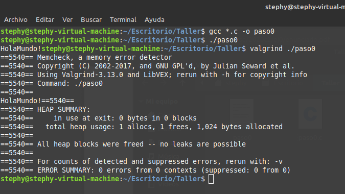

# Contador de palabras - Ejercicio N°0

###### Autora: Stephanie Izquierdo Osorio, Padrón: 104196

## Introducción:

   Este ejercicio tiene como objetivo familiarizarse con las herramientas de trabajo, preparar el entorno de trabajo y repasar la sintaxis de C como asi tambien el manejo de archivos, memoria dinamica, punteros, entrada y salida estandar, y los procesos de programación.
   Para ello el curso dispuso de archivos correspondientes a una aplicacion de consola que contabiliza la cantidad de palabras en una archivo de texto plano, con el objetivo de subirlo al sistema de entregas de trabajo practico y analizar las distintas salidas provenientes de la compilacion y ejecución de los archivos entregados.   

## Paso 0: Entorno de trabajo

   1. Captura de pantalla del aplicativo:

   

   2. Valgrind es un debugger relacionado con la memoria, que como bien se informa al invocar cualquier ejecutable con valgrind: 'Memcheck, a memory error              detector', Valgrind usa Memcheck como herramienta para detectar errores de memoria. Memcheck es capaz de detectar:
      * Acceso a memoria indebido
      * Usos de valores no inicializadas
      * Perdidas de memoria
      * Malas liberaciones de memoria heap, como por ejemplo double frees.
      * Pisado de memoria usando memcpy() y funciones similares.

   Además valgrind posee otras herramientas para poder detectar fallas de cache, para analizar los usos del heap, para tener informacion de los llamados en el programa, etc.

   3. **sizeof()** nos devuelve la cantidad de bits de lo que invoquemos junto con sizeof y depende de la arquitectura en la cual estemos trabajando, por ejemplo    el sizeof(long) en una arquitectura de 32 bits es de 4 bytes mientras que en una arquitectura de 64bits es de 8 bytes. sizeof(int) devuelve 4 tanto como para una arquitectura de 32bits o de 64bits, sizeof(char) devuelve 1 para arquitecturas de 32 o 64 bits.

   4. No siempre el sizeof() de un struct de C es igual a la suma del sizeof() de cada uno sus elementos. Por ejemplo si se tiene el struct:
   ```
      typedef struct alumno{
         int padron;
         char estado;
      } alumno_t
   ```
   y hacemos un sizeof() de alumno_t nos devolverá 8... pero ¿por qué? Si bien el struct solo está compuesto por un int (4 bytes) y 1 char (1 byte), la memoria se organiza de a    múltiplos de 4 bytes para tener un rápido acceso, por ende el compilador decide almacenarlas de esa forma a pesar de estar desperdiciando espacio.

   5. El sistema operativo Linux comienza con 3 archivos abiertos (descriptores de archivos) STDIN STDOUT STDRRR, siendo STDOUT un archivo que apunta a la consola, STDIN el    relacionado con la entrada de datos y STDERR que se encarga de añadir detalles de errores que ocurren. De todas formas estos descriptores de archivos no tiene por que apuntar exclusivamente a archivos.

      * El simbolo **>** redirecciona stdout hacía un archivo. Lo crea si no existe, si existe lo sobreescribe.

      * El simbolo **<** Redirecciona stdin desde un archivo. El contenido de un archivo es la entrada o input del comando.

      * La combinacion **2>** Redirecciona stderr hacía un archivo. Crea (>) o concatena (>>) la salida de errores a un archivo

      * La combinacion **1>&2**	Redirecciona stdout hacía donde stderr apunte.

      * La combinacion **2>&1**	Redirecciona stderr hacía donde stdout apunte.

      * Con el simbolo **|** La salida del comando a la izquierda de él se convierte en la entrada del comando a la derecha.


## Paso 1: SERCOM - Errores de generación y normas de programación

   1. Salida del sercom:

```
Descomprimiendo el codigo 'source_unsafe.zip'...
Archive:  source_unsafe.zip
  inflating: source_unsafe/paso1_main.c
  inflating: source_unsafe/paso1_wordscounter.c
  inflating: source_unsafe/paso1_wordscounter.h
Compilando el codigo...
  CC  paso1_main.o
paso1_main.c: In function ‘main’:
paso1_main.c:22:9: error: unknown type name ‘wordscounter_t’
   22 |         wordscounter_t counter;
      |         ^~~~~~~~~~~~~~
paso1_main.c:23:9: error: implicit declaration of function ‘wordscounter_create’ [-Wimplicit-function-declaration]
   23 |         wordscounter_create(&counter);
      |         ^~~~~~~~~~~~~~~~~~~
paso1_main.c:24:9: error: implicit declaration of function ‘wordscounter_process’ [-Wimplicit-function-declaration]
   24 |         wordscounter_process(&counter, input);
      |         ^~~~~~~~~~~~~~~~~~~~
paso1_main.c:25:24: error: implicit declaration of function ‘wordscounter_get_words’ [-Wimplicit-function-declaration]
   25 |         size_t words = wordscounter_get_words(&counter);
      |                        ^~~~~~~~~~~~~~~~~~~~~~
paso1_main.c:27:9: error: implicit declaration of function ‘wordscounter_destroy’ [-Wimplicit-function-declaration]
   27 |         wordscounter_destroy(&counter);
      |         ^~~~~~~~~~~~~~~~~~~~
make: *** [<builtin>: paso1_main.o] Error 1

real    0m0.181s
user    0m0.026s
sys     0m0.026s
[Error] Fallo la compilacion del codigo en 'source_unsafe.zip'. Codigo de error 2
```
   Los errores que podemos observar son debido a que en el archivo donde está la funcion 'main' se está invocando a las funciones correspondientes a la biblioteca   'wordscounter' y al tipo de dato wordscounter_t sin haber hecho el include de la biblioteca wordscounter.h , entonces el compilador lanza que se esta haciendo declaraciónes implicita de funciones y que no conoce el tipo de dato wordscounter_t, porque no estan ni implementadas en el main.c ni tampoco hay alguna referencia a ellas proveniente de alguna biblioteca. Estos errores son de compilación y de linker dado que el linker no puede encontrar las definiones de las estrcutras/funciones y a su vez estas son necesarias para la compilción del código.

A parte podemos observar en el codigo que hay errores de normas de programación:
   * No hay consistencia entre los whitespace: Si bien se respetó la indentación, hay espacios en blanco innecesarios en sentencias o no se es consistente por          ejemplo se tiene 'if ( c == EOF)'. O sea si se va a dejar un espacio entre los parentesis y lo que contiene, que sea siempre o que no se haga, quedando de la      forma: 'if ( c == EOF )' o 'if (c == EOF)' siendo esta ultima la más recomendada dado que sino tendriamos espacios innecesarios. Notar que 'if(c==EOF)' NO es      una solución, dado que esto dificulta la lectura y entendimiento del código.
   * Hay lineas vacias con un solo corchete
   * Tampoco se es consistente con las llaves de abierto y cerrado.
   * Al momento de finalizar una linea y usar ';' se considera una mala practica dejar un espacio antes.
   * Si se va a usar condicionales los else deben ser precedidos y antecedido por llaves, por ejemplo '} else {'
   * Hay sentecias  donde se no se deja un espacio entre las expreciones 'if/while/else if/etc' y la condicion.
   * Uso de funciones inseguras: gets/ strcpy. A estas funciones no se les puede poner un limite de lectura, por ende puede seguir almacenando lo leido apesar de haber superado el buffer y puede comenzar a pisar memoria que no debe.

Otros errores encontrados mirando el código:
   * En wordscounter.c se invoca la funcion malloc() sin haber importado la biblioteca que implementa dicha funcion (stdlib.h). Ademas no se implementó la funcion wordscounter_destroy(), por lo cual no se liberaria la memoria alojada .
   * Hay errores de conversion dado que en wordscounter.c: wordscounter_process(), se declara como variable entera 'c' que es igualada a la funcion gets, la cual devuelve NULL o un char. Y luego esta misma variable entera es pasada por parametro a wordscounter_next_state() la cual recibe en su lugar un char. Si bien podemos interpretar un char por su equivalente numero ascii, las conversiones de este estilo deben ser evitadas o en todo caso castearlas pero no usarlas 'asi nomás'
   * En los codigos hay literales que podrian haberse evitado.

El sistema no reportó warnings dado que se usó el flag "Werror" para que todos los warnings sean tomados como errores.

## Paso 2: SERCOM - Errores de generación 2

   1. En esta entrega se corrigieron los errores de escritura de codigo, ahora la escritura del codigo es consistente y se respetaron las normativas de codificaciones.
    (A mi parecer en paso2_main.c, en la linea 14, seria mejor que el literal 'r' este definida como una constante 'MODO_APERTURA' o 'LECTURA')

   2. Captura de pantalla indicando la correcta ejecución de verificación de normas de programación:
      ```
      Done processing /task/student//source_unsafe/paso2_wordscounter.c
      Done processing /task/student//source_unsafe/paso2_main.c
      Done processing /task/student//source_unsafe/paso2_wordscounter.h

      ```
   3. Captura de pantalla indicando los errores de generación del ejecutable:
   ```
Descomprimiendo el codigo 'source_unsafe.zip'...
Archive:  source_unsafe.zip
  inflating: source_unsafe/paso2_main.c
  inflating: source_unsafe/paso2_wordscounter.c
  inflating: source_unsafe/paso2_wordscounter.h
Compilando el codigo...
  CC  paso2_wordscounter.o
In file included from paso2_wordscounter.c:1:
paso2_wordscounter.h:7:5: error: unknown type name ‘size_t’
    7 |     size_t words;
      |     ^~~~~~
paso2_wordscounter.h:20:1: error: unknown type name ‘size_t’
   20 | size_t wordscounter_get_words(wordscounter_t *self);
      | ^~~~~~
paso2_wordscounter.h:1:1: note: ‘size_t’ is defined in header ‘<stddef.h>’; did you forget to ‘#include <stddef.h>’?
  +++ |+#include <stddef.h>
    1 | #ifndef __WORDSCOUNTER_H__
paso2_wordscounter.h:25:49: error: unknown type name ‘FILE’
   25 | void wordscounter_process(wordscounter_t *self, FILE *text_file);
      |                                                 ^~~~
paso2_wordscounter.h:1:1: note: ‘FILE’ is defined in header ‘<stdio.h>’; did you forget to ‘#include <stdio.h>’?
  +++ |+#include <stdio.h>
    1 | #ifndef __WORDSCOUNTER_H__
paso2_wordscounter.c:17:8: error: conflicting types for ‘wordscounter_get_words’
   17 | size_t wordscounter_get_words(wordscounter_t *self) {
      |        ^~~~~~~~~~~~~~~~~~~~~~
In file included from paso2_wordscounter.c:1:
paso2_wordscounter.h:20:8: note: previous declaration of ‘wordscounter_get_words’ was here
   20 | size_t wordscounter_get_words(wordscounter_t *self);
      |        ^~~~~~~~~~~~~~~~~~~~~~
paso2_wordscounter.c: In function ‘wordscounter_next_state’:
paso2_wordscounter.c:30:25: error: implicit declaration of function ‘malloc’ [-Wimplicit-function-declaration]
   30 |     char* delim_words = malloc(7 * sizeof(char));
      |                         ^~~~~~
paso2_wordscounter.c:30:25: error: incompatible implicit declaration of built-in function ‘malloc’ [-Werror]
paso2_wordscounter.c:5:1: note: include ‘<stdlib.h>’ or provide a declaration of ‘malloc’
    4 | #include <stdbool.h>
  +++ |+#include <stdlib.h>
    5 |
cc1: all warnings being treated as errors
make: *** [<builtin>: paso2_wordscounter.o] Error 1

real    0m0.164s
user    0m0.023s
sys     0m0.020s
[Error] Fallo la compilacion del codigo en 'source_unsafe.zip'. Codigo de error 2
   ```
   * error: unknown type name ‘size_t’
   * error: unknown type name ‘FILE’
   * error: conflicting types for ‘wordscounter_get_words
   * error: implicit declaration of function ‘malloc’ [-Wimplicit-function-declaration]
   * error: incompatible implicit declaration of built-in function ‘malloc’ [-Werror]

   ¿Qué está sucediendo?
     * En wordscounter.c se invoca la funcion malloc() sin haber importado la biblioteca que implementa dicha funcion (stdlib.h).
     * En wordscounter.h se hace refencia a tipos de datos que estan definidos en la biblioteca 'stdio.h' y como esta no está incluida, no los reconoce.
     * En el .h se hace referencia al tipo de dato *size_t* sin haber importado la biblioteca en donde fue definida.

   Estos errores son errores del Linker y del compilador dado que el linker no es capaz de encontrar las definiciones pertinentes y a su vez estas son necesarias para la compilación del código.

## Paso 3: SERCOM - Errores de generación 3

   1. En esta entrega se incluyeron las bibliotecas faltantes en wordscounter.h

   2. Captura de pantalla indicando la correcta ejecución de verificación de normas de programación:
   ```
Descomprimiendo el codigo 'source_unsafe.zip'...
Archive:  source_unsafe.zip
  inflating: source_unsafe/paso3_main.c
  inflating: source_unsafe/paso3_wordscounter.c
  inflating: source_unsafe/paso3_wordscounter.h
Compilando el codigo...
  CC  paso3_wordscounter.o
  CC  paso3_main.o
  LD  tp
/usr/bin/ld: paso3_main.o: in function `main':
/task/student/source_unsafe/paso3_main.c:27: undefined reference to `wordscounter_destroy'
collect2: error: ld returned 1 exit status
make: *** [/task/student/MakefileTP0:142: tp] Error 1

real    0m0.498s
user    0m0.165s
sys     0m0.089s
[Error] Fallo la compilacion del codigo en 'source_unsafe.zip'. Codigo de error 2
   ```   
   Errores:
   * undefined reference to 'wordscounter_destroy': Esto es debido a que nunca se implementó esta función, solo esta declarada en el .h. Este es un error del linker dado que no encuentra donde esta definida la función.

 ## Paso 4: SERCOM - Memory Leaks y Buffer Overflows

1. Ahora está implementada la funcion 'wordscounter_destroy', no hace nada.

2. Captura de pantalla del resultado de ejecución con Valgrind de la prueba ‘TDA’:
```
==00:00:00:00.000 59== Memcheck, a memory error detector
==00:00:00:00.000 59== Copyright (C) 2002-2017, and GNU GPL'd, by Julian Seward et al.
==00:00:00:00.000 59== Using Valgrind-3.15.0 and LibVEX; rerun with -h for copyright info
==00:00:00:00.000 59== Command: ./tp input_tda.txt
==00:00:00:00.000 59== Parent PID: 58
==00:00:00:00.000 59==
==00:00:00:01.095 59==
==00:00:00:01.095 59== FILE DESCRIPTORS: 5 open at exit.
==00:00:00:01.095 59== Open file descriptor 4: input_tda.txt
==00:00:00:01.095 59==    at 0x495FEAB: open (open64.c:48)
==00:00:00:01.095 59==    by 0x48E2195: _IO_file_open (fileops.c:189)
==00:00:00:01.095 59==    by 0x48E2459: _IO_file_fopen@@GLIBC_2.2.5 (fileops.c:281)
==00:00:00:01.095 59==    by 0x48D4B0D: __fopen_internal (iofopen.c:75)
==00:00:00:01.095 59==    by 0x48D4B0D: fopen@@GLIBC_2.2.5 (iofopen.c:86)
==00:00:00:01.095 59==    by 0x109177: main (paso4_main.c:14)
==00:00:00:01.095 59==
==00:00:00:01.095 59== Open file descriptor 3: /task/student/cases/tda/__valgrind__
==00:00:00:01.095 59==    <inherited from parent>
==00:00:00:01.095 59==
==00:00:00:01.095 59== Open file descriptor 2: /task/student/cases/tda/__stderr__
==00:00:00:01.095 59==    <inherited from parent>
==00:00:00:01.095 59==
==00:00:00:01.095 59== Open file descriptor 1: /task/student/cases/tda/__stdout__
==00:00:00:01.095 59==    <inherited from parent>
==00:00:00:01.095 59==
==00:00:00:01.095 59== Open file descriptor 0: /task/student/cases/tda/__stdin__
==00:00:00:01.095 59==    <inherited from parent>
==00:00:00:01.095 59==
==00:00:00:01.095 59==
==00:00:00:01.095 59== HEAP SUMMARY:
==00:00:00:01.095 59==     in use at exit: 1,977 bytes in 216 blocks
==00:00:00:01.095 59==   total heap usage: 218 allocs, 2 frees, 10,169 bytes allocated
==00:00:00:01.095 59==
==00:00:00:01.096 59== 472 bytes in 1 blocks are still reachable in loss record 1 of 2
==00:00:00:01.096 59==    at 0x483B7F3: malloc (in /usr/lib/x86_64-linux-gnu/valgrind/vgpreload_memcheck-amd64-linux.so)
==00:00:00:01.096 59==    by 0x48D4AAD: __fopen_internal (iofopen.c:65)
==00:00:00:01.096 59==    by 0x48D4AAD: fopen@@GLIBC_2.2.5 (iofopen.c:86)
==00:00:00:01.096 59==    by 0x109177: main (paso4_main.c:14)
==00:00:00:01.096 59==
==00:00:00:01.096 59== 1,505 bytes in 215 blocks are definitely lost in loss record 2 of 2
==00:00:00:01.096 59==    at 0x483B7F3: malloc (in /usr/lib/x86_64-linux-gnu/valgrind/vgpreload_memcheck-amd64-linux.so)
==00:00:00:01.096 59==    by 0x109301: wordscounter_next_state (paso4_wordscounter.c:35)
==00:00:00:01.096 59==    by 0x1093B5: wordscounter_process (paso4_wordscounter.c:30)
==00:00:00:01.096 59==    by 0x109197: main (paso4_main.c:24)
==00:00:00:01.096 59==
==00:00:00:01.096 59== LEAK SUMMARY:
==00:00:00:01.096 59==    definitely lost: 1,505 bytes in 215 blocks
==00:00:00:01.096 59==    indirectly lost: 0 bytes in 0 blocks
==00:00:00:01.096 59==      possibly lost: 0 bytes in 0 blocks
==00:00:00:01.096 59==    still reachable: 472 bytes in 1 blocks
==00:00:00:01.096 59==         suppressed: 0 bytes in 0 blocks
==00:00:00:01.096 59==
==00:00:00:01.096 59== For lists of detected and suppressed errors, rerun with: -s
==00:00:00:01.096 59== ERROR SUMMARY: 1 errors from 1 contexts (suppressed: 0 from 0)  
```
Los errores que figuran son debido a que en el programa se abren archivos pero nunca se cierran y tambien hay pedido de memoria porque se hicieron mallocs pero como nunca se liberaron (es decir no se hizo free de la memoria alojada) entonces figura como pérdida de memoria porque la responsabilidad de liberar esa memoria es únicamente del programador, es decir de quien la pidió.


3. Captura de pantalla del resultado de ejecución con Valgrind de la prueba ‘Long Filename’:
```
**00:00:00:01.071 47** *** memcpy_chk: buffer overflow detected ***: program terminated
==00:00:00:00.000 47== Memcheck, a memory error detector
==00:00:00:00.000 47== Copyright (C) 2002-2017, and GNU GPL'd, by Julian Seward et al.
==00:00:00:00.000 47== Using Valgrind-3.15.0 and LibVEX; rerun with -h for copyright info
==00:00:00:00.000 47== Command: ./tp input_extremely_long_filename.txt
==00:00:00:00.000 47== Parent PID: 46
==00:00:00:00.000 47==
**00:00:00:01.071 47** *** memcpy_chk: buffer overflow detected ***: program terminated
==00:00:00:01.071 47==    at 0x483E9CC: ??? (in /usr/lib/x86_64-linux-gnu/valgrind/vgpreload_memcheck-amd64-linux.so)
==00:00:00:01.071 47==    by 0x4843C0A: __memcpy_chk (in /usr/lib/x86_64-linux-gnu/valgrind/vgpreload_memcheck-amd64-linux.so)
==00:00:00:01.071 47==    by 0x109168: memcpy (string_fortified.h:34)
==00:00:00:01.071 47==    by 0x109168: main (paso4_main.c:13)
==00:00:00:01.095 47==
==00:00:00:01.095 47== FILE DESCRIPTORS: 4 open at exit.
==00:00:00:01.095 47== Open file descriptor 3: /task/student/cases/nombre_largo/__valgrind__
==00:00:00:01.095 47==    <inherited from parent>
==00:00:00:01.095 47==
==00:00:00:01.095 47== Open file descriptor 2: /task/student/cases/nombre_largo/__stderr__
==00:00:00:01.095 47==    <inherited from parent>
==00:00:00:01.095 47==
==00:00:00:01.095 47== Open file descriptor 1: /task/student/cases/nombre_largo/__stdout__
==00:00:00:01.095 47==    <inherited from parent>
==00:00:00:01.095 47==
==00:00:00:01.095 47== Open file descriptor 0: /task/student/cases/nombre_largo/__stdin__
==00:00:00:01.095 47==    <inherited from parent>
==00:00:00:01.095 47==
==00:00:00:01.095 47==
==00:00:00:01.095 47== HEAP SUMMARY:
==00:00:00:01.095 47==     in use at exit: 0 bytes in 0 blocks
==00:00:00:01.095 47==   total heap usage: 0 allocs, 0 frees, 0 bytes allocated
==00:00:00:01.095 47==
==00:00:00:01.095 47== All heap blocks were freed -- no leaks are possible
==00:00:00:01.095 47==
==00:00:00:01.095 47== For lists of detected and suppressed errors, rerun with: -s
==00:00:00:01.095 47== ERROR SUMMARY: 0 errors from 0 contexts (suppressed: 0 from 0)
```
Errores reportados: *memcpy_chk: buffer overflow detected: program terminated*
Lo que esta sucediendo es que se reservaron 30 bytes para el nombre del archivo, al ser muy grande el nombre de este (input_extremely_long_filename.txt) hay un buffer overflow, ¿y qué quiere decir? Quiere decir que se esta pisando memoria que no corresponde y debido a que el memcopy copia la cantidad de bytes(especificados en el tercer parametro) de la variable en el segundo parametro a la memoria perteneciente a la variable en el primer parametro. En el main se tiene:  

 >memcpy(filepath, argv[1], strlen(argv[1]) + 1);

siendo filepath de tamaño equivalente a 30 bytes. Si el string ingresado en el comando es mayor a 30 bytes se empezará a sobreescribir memoria que no corresponde, y es por esto el error que está tirando valgrind.

4. En caso de utilizarse strncpy ya no habría problemas con el buffer overflow dado que la funcion strncpy con firma : *strncpy(char *dest, const char *src, size_t n)*, en caso de que la longitud del string a copiar sea mayor al numero ingresado en el tercer parametro, se trunca esa diferencia de tamaño.

5. Explicación de qué se trata un segmentation fault y un buffer overflow:
   * Segmentetion fault (Violacion de segmento): Ocurre cuando se intenta acceder o escribir en memoria que no nos pertenece ya sea porque o la esta usando otro proceso o porque ya no existe dentro de nuestro programa o porque es una memoria reservada como por ejemplo la 0x0, etc.
   * Buffer overflow (Desbordamiento de búfer): Sucede cuando se excede la cantidad de memoria asiganada/reservada. Cuando esto sucede, se sobrescribe memoria que no nos pertenece, pudiendo generar así también un segmentation fault.

## Paso 5 : SERCOM - Código de retorno y salida estándar

1. Correcciones realizadas respecto de la versión anterior:
   * En el main: se cambio la logica de recibir el nombre del archivo, ahora se accede directamente a lo ingresado como comonado y se agregó el cierre de dicho archivo.
   * En el wordscounter.c ya no se solicita memoria.

2. La prueba de una_palabra falla porque el archivo solo contiene "word" y no posee ningun "delim_words" por ende nunca entra al if de la linea 44 en paso5_wordscounter.c, entonces cuando termina de leer la d, en el paso siguiente, c es un EOF y segun el flujo del codigo cuando pasa eso retorna que el estado siguiente es que terminó y se va sin haber contado la palabra.

   La prueba de archivo_invalido sinceramente no se porque falla ni por que cuenta 255 siendo que posee un "delim_words" dado que corriendolo ocn hexdump obtuve la salida:
   ```
   00000000  77 6f 72 64  0a                                     |word.|
   00000005
   ```
   donde 0a representa un espacio.
   Además corri el programa con valgrind, gdb, seguí el codigo, pero sigo sin entender de donde cuenta 255, adjunto captura de lo que corri en la terminal:

```     
stephy@stephy-virtual-machine:~/Descargas/paso5$ ./tp "input_one_word.txt"
1
stephy@stephy-virtual-machine:~/Descargas/paso5$ valgrind ./tp "input_one_word.txt"
==3586== Memcheck, a memory error detector
==3586== Copyright (C) 2002-2017, and GNU GPL'd, by Julian Seward et al.
==3586== Using Valgrind-3.13.0 and LibVEX; rerun with -h for copyright info
==3586== Command: ./tp input_one_word.txt
==3586==
1
==3586==
==3586== HEAP SUMMARY:
==3586==     in use at exit: 0 bytes in 0 blocks
==3586==   total heap usage: 3 allocs, 3 frees, 5,672 bytes allocated
==3586==
==3586== All heap blocks were freed -- no leaks are possible
==3586==
==3586== For counts of detected and suppressed errors, rerun with: -v
==3586== ERROR SUMMARY: 0 errors from 0 contexts (suppressed: 0 from 0)

stephy@stephy-virtual-machine:~/Descargas/paso5$ gdb ./tp "input_one_word.txt"
GNU gdb (Ubuntu 8.1-0ubuntu3.1) 8.1.0.20180409-git
Copyright (C) 2018 Free Software Foundation, Inc.
License GPLv3+: GNU GPL version 3 or later <http://gnu.org/licenses/gpl.html>
This is free software: you are free to change and redistribute it.
There is NO WARRANTY, to the extent permitted by law.  Type "show copying"
and "show warranty" for details.
This GDB was configured as "x86_64-linux-gnu".
Type "show configuration" for configuration details.
Para las instrucciones de informe de errores, vea:
<http://www.gnu.org/software/gdb/bugs/>.
Find the GDB manual and other documentation resources online at:
<http://www.gnu.org/software/gdb/documentation/>.
For help, type "help".
Type "apropos word" to search for commands related to "word"...
Leyendo símbolos desde ./tp...hecho.
«/home/stephy/Descargas/paso5/input_one_word.txtx no es un volcado del núcleo: No se reconoce el formato del fichero
```  
tampoco entendí porqué segun gdb el archivo se llama "input_one_word.txtx" cuando se llama "input_one_word.txt".


   Información entregada por SERCOM para identificar el error:
```   
[=>] Comparando archivo_invalido/__return_code__...
1c1
< 255
---
> 1


[=>] Comparando archivo_invalido/__stdout__...
[=>] Comparando entrada_estandar/__return_code__...
[=>] Comparando entrada_estandar/__stdout__...
[=>] Comparando lenguage_c/__return_code__...
[=>] Comparando lenguage_c/__stdout__...
[=>] Comparando nombre_largo/__return_code__...
[=>] Comparando nombre_largo/__stdout__...
[=>] Comparando tda/__return_code__...
[=>] Comparando tda/__stdout__...
[=>] Comparando una_palabra/__return_code__...
[=>] Comparando una_palabra/__stdout__...
1c1
< 0
---
> 1

[Error] Se encontraron diferencias entre las salidas obtenidas y las esperadas.
```

3. Captura de pantalla de la ejecución del comando hexdump con el archivo "input_single_word":
   ```
   00000000  77 6f 72 64                                       |word|
   00000004
   ```
   El ultimo caracter es el correspondiente a la letra d

4. Captura de pantalla con el resultado de la ejecución con gdb:

```
Leyendo símbolos desde ./tp...hecho.
(gdb) info functions
All defined functions:

File paso5_main.c:
int main(int, char **);

File paso5_wordscounter.c:
void wordscounter_create(wordscounter_t *);
void wordscounter_destroy(wordscounter_t *);
size_t wordscounter_get_words(wordscounter_t *);
void wordscounter_process(wordscounter_t *, FILE *);
static char wordscounter_next_state(wordscounter_t *, char, char);

Non-debugging symbols:
0x0000000000000690  _init
0x00000000000006c0  fclose@plt
0x00000000000006d0  __stack_chk_fail@plt
0x00000000000006e0  strchr@plt
0x00000000000006f0  _IO_getc@plt
0x0000000000000700  __printf_chk@plt
0x0000000000000710  fopen@plt
0x0000000000000720  __cxa_finalize@plt
0x00000000000007e0  _start
0x0000000000000810  deregister_tm_clones
---Type <return> to continue, or q <return> to quit---
0x0000000000000850  register_tm_clones
0x00000000000008a0  __do_global_dtors_aux
0x00000000000008e0  frame_dummy
0x00000000000009f0  __libc_csu_init
0x0000000000000a60  __libc_csu_fini
0x0000000000000a64  _fini
(gdb) list wordscounter_next_state
29	        int c = getc(text_file);
30	        state = wordscounter_next_state(self, state, c);
31	    } while (state != STATE_FINISHED);
32	}
33
34	static char wordscounter_next_state(wordscounter_t *self, char state, char c) {
35	    const char* delim_words = " ,.;:\n";
36
37	    char next_state = state;
38	    if (c == EOF) {
(gdb) list
39	        next_state = STATE_FINISHED;
40	    } else if (state == STATE_WAITING_WORD) {
41	        if (strchr(delim_words, c) == NULL)
42	            next_state = STATE_IN_WORD;
43	    } else if (state == STATE_IN_WORD) {
44	        if (strchr(delim_words, c) != NULL) {
45	            self->words++;
46	            next_state = STATE_WAITING_WORD;
47	        }
48	    }
(gdb) break 45
Punto de interrupción 1 at 0x964: file paso5_wordscounter.c, line 45.
(gdb) run input_single_word.txt
Starting program: /home/stephy/Descargas/paso5/tp input_single_word.txt
0
[Inferior 1 (process 8336) exited normally]
(gdb) quit

```
Comandos utilizados en gdb:
   * info functions : imprime por pantalla los nombres y tipos de dato de todas las funciones definidas.
   * list wordscounter_next_state : imprime por pantalla las lineas en el código teniendo a la funcion wordscounter_next_state centrada ( es decir imprime lineas anteriores a la funcion y lineas de la propia funcion).
   * list : imprime lineas del codigo, al haber hecho anteriormente list, continua desde la ultima linea impresa.
   * break 45 : Ubica un breakpoint en la linea 45 del archivo actual.
   * run input_single_word.txt : corre el programa con los argumentos seguidos de run.
   * quit : cerrar gdb.

¿Por qué motivo el debugger no se detuvo en el breakpoint de la línea 45: self->words++; ? Porque en ningun momento al ejecutar el programa se entro/procesó a esa linea debido que esta dentro de un bloque condicional en el cual no se cumplia dicha condición, por ende, no entra nunca a la linea 45.

## Paso 6: SERCOM - Entrega exitosa

1. Correcciones realizadas respecto de la versión anterior: Se cambio la logica de procesar la siguiente palabra cubriendo mejor los casos con los condicionales.

2. Captura de pantalla mostrando todas las entregas realizadas, tanto exitosas como fallidas:

   - [X] 03/10/2020 01:46:35 - 100.0%
   - [ ] 03/10/2020 04:12:05 - 0.0%
   - [ ] 02/10/2020 22:24:48 - 0.0%
   - [ ] 02/10/2020 21:52:33 - 0.0%
   - [ ] 02/10/2020 20:21:35 - 0.0%
   - [ ] 02/10/2020 18:08:48 - 0.0%

3. Captura de pantalla mostrando la ejecución de la prueba ‘Single Word’ de forma local con las distintas variantes indicadas:
```
stephy@stephy-virtual-machine:~/Descargas/paso6$ make
  CC  paso6_wordscounter.o
  CC  paso6_main.o
  LD  tp
stephy@stephy-virtual-machine:~/Descargas/paso6$ ./tp input_single_word.txt
1
stephy@stephy-virtual-machine:~/Descargas/paso6$ ./tp <input_single_word.txt
1
stephy@stephy-virtual-machine:~/Descargas/paso6$ ./tp <input_single_word.txt >output_single_word.txt
```
