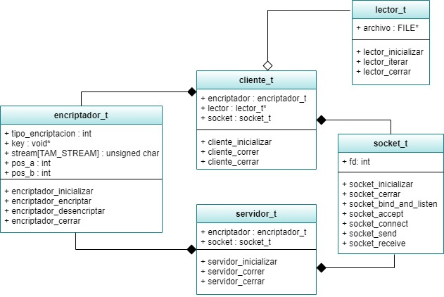

# CryptoSockets - Ejercicio N°1

###### Autora: Stephanie Izquierdo Osorio, Padrón: 104196

## NOTA: 10

## Introducción:

Este ejercicio tiene como objetivo poner el práctica lo aprendido de Sockets y protocolo TCP, reforzar la correcta creacion de TDAs, reforzar las herramientas de manejo de archivos, memoria dinámica, punteros, entrada y salida estandar,etc.

## Programa:

Este ejercicio consta de establecer una conexión entre un programa cliente (emisor) y un servidor (receptor). El cliente leerá un mensaje, lo encriptará y lo enviará. El receptor debera recibirlo, decifrarlo y lo mostrará por salida estandar.

El cliente se ejecutará usando el siguiente formato:
```
 ./client <server-host> <server-port> --method=<method> --key=<key>
```

Y el servidor con el siguiente:
 ```
  ./server <server-port> --method=<method> --key=<key>
 ```
Donde los argumentos “method” podrá recibir: cesar, vigenere o rc4.
###### Nota: primero debe ejecutarse el servidor.

## Modelo:

  Para llevar a cabo este ejercicio se modelaron las siguientes entidades: Socket, Encriptador, Lector, Servidor y Cliente. Las relaciones entre ellas son las siguientes:

  

  Para poder conservar el encapsulamiento se hizo uso de punteros a funciones/callbacks, dado que si no las usara no habría forma que lector no conociera a encriptador o socket , pero como se quizo conservar el encapsulamiento y que funcionen independientemente se conservaron los callbaks/punteros a funciones.
  Otra decisión que se tomó es la de no separar los distintos tipos de encriptadores, dado que el lenguaje de programación de por si es estructurado es decir no nos da las herramientas como por ejemplo herencia, interfaces, abstracción, el hecho de hacer encriptadores especificos retorcia más el código porque había que hacer múltiples chequeos y deberían hacerse explícitamente los "includes" de forma tal que no existe la situación: "si solo voy a encriptar con cesar, entonces solo conozco a cesar_t y encriptador_t". Entonces, lo que sí se hizo para mejorar el código fue generalizar más las acciones como encriptar/desencriptar específicos a un tipo de metodo.

## Cambios respecto de la primera entrega:
 * Las secciones del readme fueron actualizadas explicando los cambios hechos.

     TP1-Taller#2
 * Cambios con respecto el Cliente:
          Se agregó el TDA cliente y es este quien hace las inicializaciones, operaciones y cierres de lo que necesite, interactuando con el socket, encriptador y lector.
          En el main correspondiente al cliente se mejoró el código, se englobaron más las funciones, se declararon constantes, el código está más legible y el main quedo más prolijo. Además se eliminó  ```POSIX_C_SOURCE 200112L ``` porque no se lo necesitaba.

    TP1-Taller#4
 * Cambios con respecto al Servidor:
          Se agregó el TDA Servidor.
          El main del servidor fue simplificado y se llevó toda la lógica del servidor y las operaciones correspondientes a su TDA.

   TP1-Taller#3
 * Se arregló el bug con respecto al offset incorrecto.

 * Hubieron cambios en los tipos de datos de las funciones para poder tener mejor cobertura de errores.

 * En todos los TDAS se cambiaron algunas partes de código buscando una simplificación de las operaciones y tratando de que el código sea mucho más prolijo.

 * Los callbacks que habian en el socket fueron resueltos porque se simplificaron las funciones y el servidor es quien se encarga de llamar a las correspondientes funciones. Sin embargo, en el lector permanecieron los callbaks para mantener el encapsulamiento y que no hayan relaciones entre los TDAS, salvo el cliente con el resto de TDAS y el servidor con los TDAS. De todas formas se mejoró el código para que estos callbaks sean comprensibles y para que no se perdiera el hilo del código.
